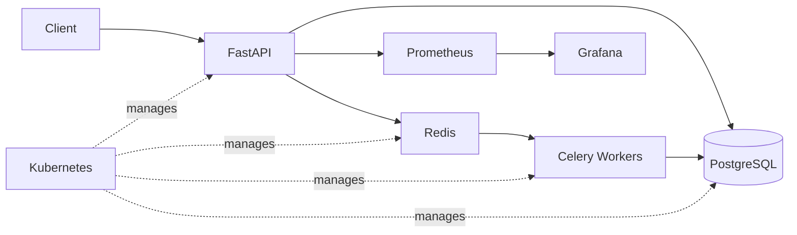

# QueueForge

QueueForge is a distributed CSV processing platform built with FastAPI, Celery, Redis, PostgreSQL, Docker, and Kubernetes. It accepts CSV uploads as asynchronous jobs, processes them through a background worker queue, persists job state and results, and exposes health, readiness, and Prometheus metrics for monitoring. The platform is containerized, Kubernetes-deployable, horizontally scalable, and backed by automated testing and CI.

## What It Does

- Upload CSV jobs
- Persist jobs in PostgreSQL
- Enqueue work through Redis
- Process jobs asynchronously with Celery
- Expose job status and results through FastAPI

## Architecture



## Tech Stack

- Python
- FastAPI
- SQLAlchemy
- PostgreSQL
- Redis
- Celery
- Docker
- Kubernetes
- Prometheus
- Grafana
- GitHub Actions
- Pytest
- Ruff
- mypy

## Key Features

- Asynchronous background processing
- Persistent job state
- CSV validation
- Health and readiness endpoints
- Docker Compose local stack
- Kubernetes deployments and services
- Worker autoscaling
- Prometheus metrics
- Grafana dashboard
- CI pipeline

## API

- `POST /api/v1/jobs`
- `GET /api/v1/jobs`
- `GET /api/v1/jobs/{id}`
- `GET /health`
- `GET /ready`
- `GET /metrics`

## Local Development

Create and activate a virtual environment, install dependencies, start the local stack, and apply database migrations.

```powershell
python -m venv .venv
.\.venv\Scripts\Activate.ps1
pip install -e ".[dev]"
docker compose up
alembic upgrade head
```

## Kubernetes

- Create a local cluster with kind
- Configure Kubernetes secrets
- Apply Kubernetes manifests
- Deploy FastAPI, Celery workers, Redis, PostgreSQL, Prometheus, and Grafana

## Testing

Run the automated test suite, linting, and static type checks with:

```powershell
pytest
ruff check .
mypy app tests
```

## Project Structure

- `app/` - FastAPI application, database logic, Celery tasks, and metrics
- `tests/` - Automated tests
- `k8s/` - Kubernetes manifests
- `grafana/` - Provisioned Grafana dashboard configuration
- `.github/workflows/` - GitHub Actions CI
- `alembic/` - Database migrations

## Future Improvements

- Queue-depth-based autoscaling using Redis/Celery workload metrics
- Object storage for larger CSV uploads
- Authentication and role-based access control
- Production cloud deployment
